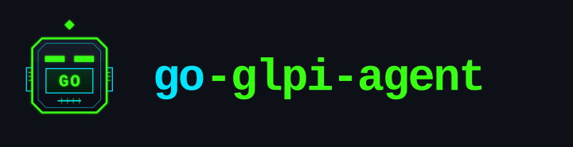
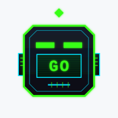

# Brand assets — go-glpi-agent

Logo, mascot variants and brand images for the project. Every mark ships as **SVG**
(vector, editable) **and PNG**. The **official** logo is `logo.svg` (mark) +
`logo-horizontal.svg` (lockup with the project name); the rest are candidates kept for
comparison.

> Previews below are rendered on a card so every style is visible regardless of theme.

## Official — tech / minimal

`logo.svg` · `logo-horizontal.svg` · `logo.png` / `logo@2x.png`

## Candidates

### 🤖 Kawaii (flat, friendly)

`logo-kawaii.svg` · `logo-kawaii-horizontal.svg`

### ✨ 3D (glossy)

`logo-3d.svg` · `logo-3d-horizontal.svg`

### 🌃 Cyberpunk (square, neon — best on dark)

`logo-cyber.svg` · `logo-cyber-horizontal.svg`

## Monochrome & dark-background marks

| Mono (single-ink) | White (for dark backgrounds) |
|---|---|
|  |  |
| `logo-mono.svg` · `logo-mono-horizontal.svg` | `logo-white.svg` (mark; white text is invisible except on dark) |

## Marks at a glance

| Official | Kawaii | 3D | Cyberpunk | Mono |
|---|---|---|---|---|
|  |  |  |  |  |

## Other assets

- `banner.jpg` — README hero banner.
- `favicon.ico` · `favicon.svg` · `favicon-32.png` — site/tab icon.

## Notes

- SVGs are the source of truth; PNGs are rendered with `rsvg-convert` (and the favicon
  `.ico` is assembled with Pillow).
- The mascot candidates were explored with the `grok` CLI (kawaii, 3D); the official mark,
  cyberpunk variant and all lockups/variants are hand-authored SVG.
- To switch the official logo, replace `logo.svg`/`logo-horizontal.svg` with a chosen
  candidate and regenerate the favicon / white / mono variants from it.
